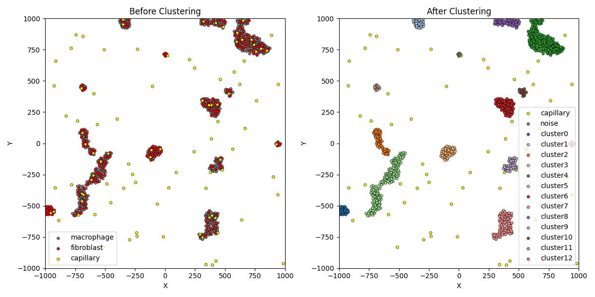
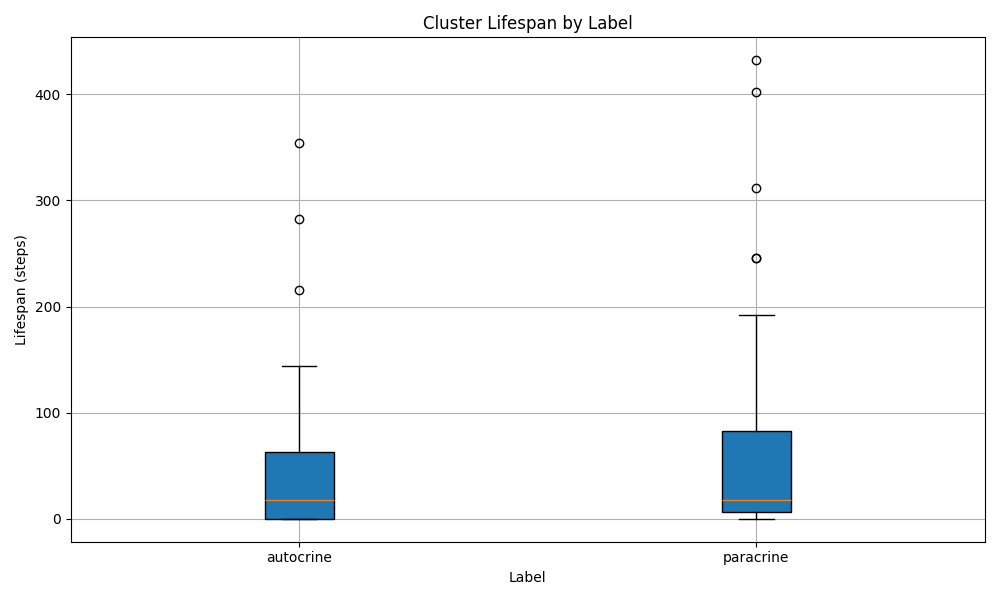

# AnalysisProject

## プロジェクトの概要

AnalysisProjectは、細胞シミュレーションデータのクラスタリング・時系列解析・可視化を自動化するPythonプロジェクトです。  
XML形式のシミュレーション出力から細胞のクラスタリングや各種統計量を算出し、可視化まで一連の流れをサポートします。

---

## ディレクトリ構成

```
AnalysisProject/
├── analysis/
│   ├── modules/         # 解析用モジュール（snapshot, timeseriesなど）
│   ├── utils/           # ユーティリティ関数
│   ├── config/          # 設定ファイル（config_analysis.iniなど）
│   ├── plot_cell_count.py
│   ├── plot_cluster_lifespan.py
│   ├── plot_cluster_tree.py
│   ├── plot_snapshot.py
├── examples/            # 出力例
├── requirements.txt     # 必要なPythonパッケージ
├── README.md            # このファイル
```

---

## 使い方

### 1. 環境構築

```sh
python -m venv .venv
.venv\Scripts\activate  # Windowsの場合
pip install -r requirements.txt
```

### 2. 解析の実行例

#### クラスタリング前後のスナップショット可視化

```sh
python analysis/plot_snapshot.py
```
- プロンプトに従い、解析対象ディレクトリを入力してください。
- 描画したいXMLファイル名（未入力なら `final.xml`）を入力してください。



#### 細胞数の時系列プロット

```sh
python analysis/plot_cell_count.py
```
- 解析対象ディレクトリとステップ間隔を入力してください。


#### クラスタ寿命の可視化

```sh
python analysis/plot_cluster_lifespan.py
```
- 解析対象ディレクトリとステップ間隔を入力してください。



---

#### クラスターの時系列変化をツリーグラフで可視化

```sh
python analysis/plot_cluster_tree.py
```
- 解析対象ディレクトリとステップ間隔を入力してください。


---


---

必要に応じて、設定ファイル（`analysis/config/config_analysis.ini`）を編集してパラメータを調整してください。
